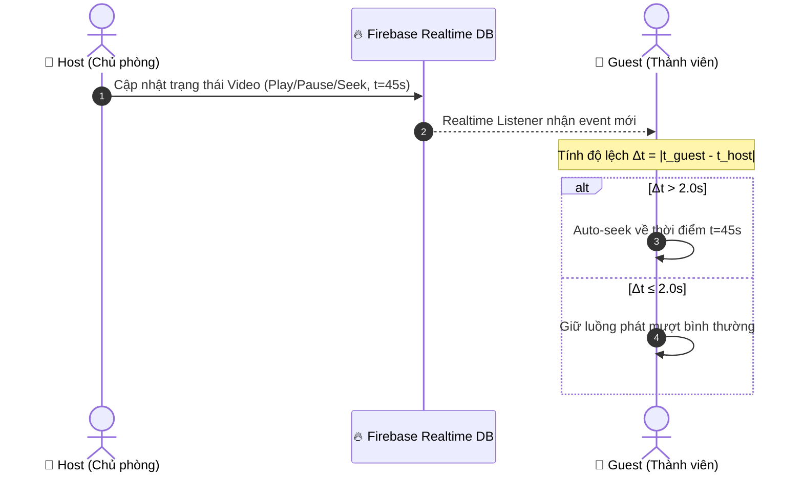
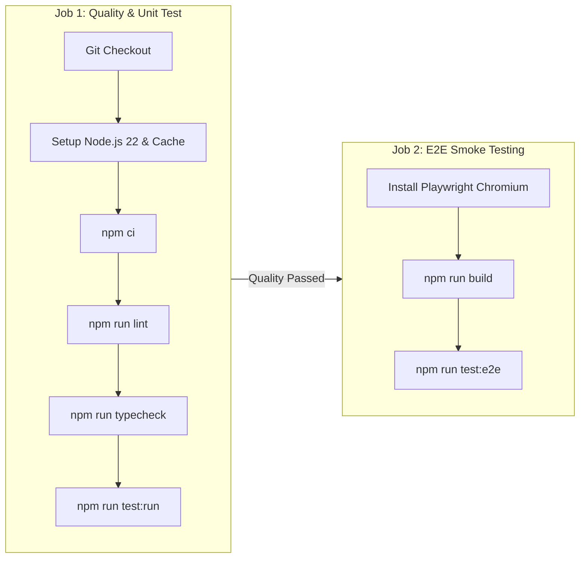

# 🎬 FILM — Nền Tảng Xem Phim & Watch Party Thời Gian Thực

[](https://nextjs.org/)
[](https://react.dev/)
[](https://www.typescriptlang.org/)
[](https://tailwindcss.com/)
[](https://firebase.google.com/)
[](https://vitest.dev/)
[](https://playwright.dev/)
[](https://film-project-beta.vercel.app/)

> **FILM** là một ứng dụng web xem phim trực tuyến doanh nghiệp (Enterprise-grade Movie Streaming Platform), được thiết kế tối ưu hóa hiệu năng, bảo mật và trải nghiệm người dùng. Ứng dụng tích hợp công nghệ **Watch Party** (xem phim chung thời gian thực với cơ chế tự động chuyển giao quyền Host), trình phát video **HLS.js** tùy biến cao, cùng hệ thống lưu trữ đồng bộ trạng thái cá nhân hóa qua **Firebase Realtime Database**.

🌐 **Trải nghiệm Demo Trực Tuyến:** [film-project-beta.vercel.app](https://film-project-beta.vercel.app/)

---

## 📋 Mục lục

1. [🎯 Định hướng Kiến trúc & Nguyên lý Thiết kế](#-định-hướng-kiến-trúc--nguyên-lý-thiết-kế)
2. [✨ Chi tiết Tính năng & Cơ chế Hoạt động](#-chi-tiết-tính-năng--cơ-chế-hoạt-động)
   - [1. Danh mục Phim & Bộ lọc Đa chiều](#1-danh-mục-phim--bộ-lọc-đa-chiều)
   - [2. Trình phát Video HLS.js & Tiến trình xem](#2-trình-phát-video-hlsjs--tiến-trình-xem)
   - [3. Watch Party — Cơ chế Đồng bộ & Host Migration](#3-watch-party--cơ-chế-đồng-bộ--host-migration)
   - [4. Hệ thống Xác thực & Cá nhân hóa](#4-hệ-thống-xác-thực--cá-nhân-hóa)
   - [5. Giao diện & Trải nghiệm Người dùng (UI/UX)](#5-giao-diện--trải-nghiệm-người-dùng-uiux)
3. [🗺️ Bản đồ Tuyến đường (App Router Routes Map)](#️-bản-đồ-tuyến-đường-app-router-routes-map)
4. [🛠️ Bảng Công nghệ & Thư viện Phụ thuộc](#️-bảng-công-nghệ--thư-viện-phụ-thuộc)
5. [📐 Cấu trúc Mã nguồn (Feature-Sliced Design)](#-cấu-trúc-mã-nguồn-feature-sliced-design)
6. [🔌 Tích hợp API (PhimAPI Technical Specs)](#-tích-hợp-api-phimapi-technical-specs)
7. [🔥 Firebase Schema & Security Rules Breakdown](#-firebase-schema--security-rules-breakdown)
8. [🚀 Hướng dẫn Cài đặt & Khởi chạy Cục bộ](#-hướng-dẫn-cài-đặt--khởi-chạy-cục-bộ)
9. [🔑 Biến Môi Trường (Environment Variables)](#-biến-môi-trường-environment-variables)
10. [⚙️ Chi tiết Danh sách Scripts (NPM Scripts Reference)](#️-chi-tiết-danh-sách-scripts-npm-scripts-reference)
11. [🧪 Kiểm thử & Quản lý Chất lượng (QA & Testing)](#-kiểm-thử--quản-lý-chất-lượng-qa--testing)
12. [🔄 Quy trình CI/CD (GitHub Actions Pipeline)](#-quy-trình-cicd-github-actions-pipeline)
13. [📄 Giấy phép & Tuyên bố Miễn trừ](#-giấy-phép--tuyên-bố-miễn-trừ)

---

## 🎯 Định hướng Kiến trúc & Nguyên lý Thiết kế

Dự án **FILM** được xây dựng trên các tiêu chuẩn phát triển phần mềm hiện đại nhằm đảm bảo tính sẵn sàng cao, dễ bảo trì và mở rộng:

- **Feature-Sliced Design (FSD)**: Chia nhỏ mã nguồn theo từng miền nghiệp vụ riêng biệt (`auth`, `film`, `player`, `watch-party`), hạn chế phụ thuộc chéo (Circular Dependencies).
- **Server-Driven Routing & State Management**: Kết hợp **Next.js App Router** cho các trang render phía server (SSR/SSG) và **nuqs** cho việc quản lý trạng thái bộ lọc/tìm kiếm trực tiếp trên URL Query String.
- **Event-Driven Realtime Synchronization**: Sử dụng WebSocket kết hợp Firebase Realtime Database để đồng bộ phát video theo thời gian thực với độ trễ thấp (< 200ms).
- **High Resilience & Automatic Failover**: Thiết kế thuật toán **Host Migration** tự động xử lý khi Host mất kết nối mà không làm gián đoạn phòng xem phim.
- **Strict Type Safety**: Áp dụng TypeScript phiên bản mới nhất kết hợp với **Zod** để validate schema dữ liệu trả về từ API và Firebase.

---

## ✨ Chi tiết Tính năng & Cơ chế Hoạt động

### 1. Danh mục Phim & Bộ lọc Đa chiều

- **Phân loại nội dung phong phú**:
  - **Phim Mới Cập Nhật** (`/phim-moi`): Danh sách các bộ phim mới được biên tập và cập nhật luồng phát.
  - **Phim Bộ** (`/phim-bo`): Phim nhiều tập (Drama/Series), hỗ trợ xem danh sách tập chi tiết.
  - **Phim Lẻ** (`/phim-le`): Phim điện ảnh (Feature movies), thời lượng chiếu đơn tập.
  - **Phim Hoạt Hình** (`/hoat-hinh`): Anime và phim hoạt hình chiếu mạng.
  - **TV Shows** (`/tv-shows`): Chương trình truyền hình, mảng giải trí.
- **Bộ lọc đa tiêu chí (Multi-criteria Filter)**:
  - Lọc kết hợp: Thể loại (`category`), Quốc gia (`country`), Năm phát hành (`year`), Ngôn ngữ (`lang_key`: Vietsub, Thuyết minh, Lồng tiếng), Tiêu chí sắp xếp (`modified.time`, `_id`, `year`).
  - Phân trang thông minh (Pagination) với dải trang động.
- **Tìm kiếm tức thì (Instant Search)**:
  - Tìm kiếm theo tên phim (Tiếng Việt & Tên gốc tiếng Anh/Gốc).
  - Quản lý trạng thái từ khóa trên URL qua `nuqs`, hỗ trợ người dùng bookmark hoặc chia sẻ đường link kết quả tìm kiếm.

### 2. Trình phát Video HLS.js & Tiến trình xem

- **Trình phát HLS.js Tùy biến**:
  - Hỗ trợ phát chuẩn định dạng `.m3u8` (HTTP Live Streaming) độ phân giải từ SD đến Full HD / 4K.
  - Tự động chọn chất lượng phát phù hợp dựa trên băng thông kết nối mạng (Adaptive Bitrate Streaming).
  - Hỗ trợ đổi máy chủ phát (Server Switch) tức thì khi một luồng phát gặp lỗi.
- **URL Deep-linking & Nhớ tiến trình xem**:
  - URL dạng `/phim/[slug]?ep=[episode_slug]&t=[seconds]`.
  - Tự động ghi nhớ thời gian dừng xem mỗi 5 giây vào **Firebase Realtime Database** (`/continue_watching/$uid`). Khi quay lại, video tự động tua đến đúng giây đang xem dở.
- **Tính năng phát nâng cao**:
  - **Autoplay & Auto-next**: Tự động chuyển và phát tập tiếp theo ngay khi tập hiện tại kết thúc mà không reload trang.
  - **Chế độ Rạp phim (Theater Mode)**: Mở rộng khung hình phát tối đa trong cửa sổ trình duyệt.
  - **Điều khiển phím tắt (Keyboard Shortcuts)**:
    - `Space` / `K`: Bật / Tạm dừng (Play / Pause).
    - `F`: Bật / Tắt Toàn màn hình (Fullscreen).
    - `T`: Bật / Tắt Chế độ rạp phim.
    - `M`: Bật / Tắt Tiếng (Mute / Unmute).
    - `←` / `→`: Tua lùi / Tua tới 5 giây.
    - `↑` / `↓`: Tăng / Giảm 10% âm lượng.

### 3. Watch Party — Cơ chế Đồng bộ & Host Migration

Watch Party là tính năng cốt lõi cho phép nhóm người dùng cùng xem phim trực tuyến:



- **Đồng bộ luồng phát thời gian thực (Playback Sync Algorithm)**:
  - Host kiểm soát trạng thái phòng chiếu tại node `/watch_party_rooms/$roomId/status`.
  - Khi Host bấm **Play**, **Pause**, **Seek** hoặc **Đổi tập**, trạng thái được đẩy lập tức lên Firebase.
  - Trình duyệt của các Guest lắng nghe sự kiện: Nếu thời gian phát của Guest bị lệch quá **2.0 giây** so với Host, hệ thống sẽ tự động điều chỉnh tua (Auto-seek) về đúng vị trí của Host để duy trì sự đồng bộ.
- **Thuật toán Chuyển giao quyền Host (Host Migration)**:
  - Mỗi thành viên kết nối duy trì trạng thái presence qua `onDisconnect()` của Firebase SDK.
  - Khi Host ngắt kết nối đột ngột:
    1. Trạng thái `connected` của Host chuyển thành `false`, ghi nhận `disconnectedAt = Date.now()`.
    2. Trong thời gian **Grace Period (15 phút)**, nếu Host quay lại, quyền Host được khôi phục.
    3. Nếu quá 15 phút hoặc Host chủ động rời phòng, hàm `pickNextHost()` sẽ quét danh sách các thành viên còn lại đang kết nối (`connected === true`), chọn thành viên tham gia sớm nhất (`joinedAt` nhỏ nhất - chuẩn FIFO) để thăng cấp làm Host mới.
    4. Hệ thống đẩy tin nhắn tự động: `"[Tên Thành Viên] đã trở thành Chủ phòng mới"`.
- **Hệ thống Chat & Tương tác Emoji**:
  - Khung chat thời gian thực hỗ trợ tối đa 500 ký tự mỗi tin nhắn.
  - Tính năng thả biểu cảm Emoji nổi (Floating Reactions) hiển thị tức thì trên màn hình xem phim của tất cả thành viên.
  - Giới hạn phòng xem: Tối đa 20 thành viên/phòng để tối ưu hiệu năng băng thông truyền nhận dữ liệu.

### 4. Hệ thống Xác thực & Cá nhân hóa

- **Firebase Authentication**:
  - Đăng nhập / Đăng ký qua Email & Mật khẩu.
  - Đăng nhập nhanh 1-Click bằng **Google OAuth Provider**.
  - Tự động làm mới Firebase ID Token và đồng bộ trạng thái đăng nhập qua Zustand Store (`useAuthStore`).
- **Quản lý Cá nhân hóa**:
  - **Danh sách Yêu thích (Watchlist)**: Lưu lại các phim muốn xem sau, hỗ trợ thao tác thêm/xóa nhanh.
  - **Lịch sử Xem phim (Continue Watching)**: Hiển thị các phim đang xem dở kèm hình ảnh poster, tập phim hiện tại và thanh tiến trình phần trăm (%) trực quan.

### 5. Giao diện & Trải nghiệm Người dùng (UI/UX)

- **Hệ thống Theme Sáng / Tối (`next-themes`)**: Tự động nhận diện theme hệ điều hành hoặc cho phép người dùng tùy chỉnh giao diện Dark/Light.
- **Tối ưu Tốc độ Tải trang**:
  - Sử dụng `react-loading-skeleton` thiết kế skeleton loader khớp 100% với layout của phim card và trang chi tiết.
  - Tích hợp `react-lazy-load-image-component` tối ưu hóa tải hình ảnh poster/thumbnail.
- **Thiết kế Responsive Đa nền tảng**: Tương thích hoàn hảo với Mobile (320px+), Tablet, Laptop và màn hình Desktop độ phân giải cao.

---

## 🗺️ Bản đồ Tuyến đường (App Router Routes Map)

| Đơn vị tuyến đường      | Thành phần Layout / Page                  | Chức năng & Mô tả                                                                 |
| :---------------------- | :---------------------------------------- | :-------------------------------------------------------------------------------- |
| `/`                     | `src/app/(main)/page.tsx`                 | Trang chủ: Hero banner phim nổi bật, Slider phim mới cập nhật, danh mục phân loại |
| `/phim-moi`             | `src/app/(main)/phim-moi/page.tsx`        | Danh sách phim mới phát hành có phân trang                                        |
| `/phim-bo`              | `src/app/(main)/phim-bo/page.tsx`         | Danh sách phim bộ (Series)                                                        |
| `/phim-le`              | `src/app/(main)/phim-le/page.tsx`         | Danh sách phim lẻ (Movies)                                                        |
| `/hoat-hinh`            | `src/app/(main)/hoat-hinh/page.tsx`       | Danh sách phim hoạt hình / Anime                                                  |
| `/tv-shows`             | `src/app/(main)/tv-shows/page.tsx`        | Danh sách chương trình truyền hình / TV Shows                                     |
| `/the-loai/[slug]`      | `src/app/(main)/the-loai/[slug]/page.tsx` | Danh sách phim lọc theo slug thể loại (ví dụ: `hanh-dong`, `tinh-cam`)            |
| `/quoc-gia/[slug]`      | `src/app/(main)/quoc-gia/[slug]/page.tsx` | Danh sách phim lọc theo slug quốc gia (ví dụ: `trung-quoc`, `han-quoc`)           |
| `/search`               | `src/app/(main)/search/page.tsx`          | Trang tìm kiếm kết hợp bộ lọc nâng cao (category, country, year, sort)            |
| `/phim/[slug]`          | `src/app/(main)/phim/[slug]/page.tsx`     | Chi tiết phim, thông tin đạo diễn, diễn viên, danh sách tập và trình phát HLS     |
| `/user`                 | `src/app/(main)/user/page.tsx`            | Trang cá nhân người dùng: Quản lý thông tin, Watchlist và Lịch sử xem phim        |
| `/watch-party`          | `src/app/watch-party/page.tsx`            | Lobby Watch Party: Danh sách phòng xem phim công khai, modal tạo phòng mới        |
| `/watch-party/[roomId]` | `src/app/watch-party/[roomId]/page.tsx`   | Căn phòng xem phim nhóm thời gian thực (Player + Sync + Chat + Members)           |

---

## 🛠️ Bảng Công nghệ & Thư viện Phụ thuộc

### Core Dependencies (`package.json`)

```json
{
  "next": "16.2.9",
  "react": "19.2.4",
  "typescript": "^6.0.3",
  "tailwind CSS": "^3.4.19",
  "firebase": "^12.15.0",
  "hls.js": "^1.6.16",
  "@tanstack/react-query": "^5.101.2",
  "zustand": "^5.0.14",
  "framer-motion": "^12.42.2",
  "lucide-react": "^1.23.0",
  "nuqs": "^2.9.0",
  "sonner": "^2.0.7",
  "zod": "^4.4.3"
}
```

### Chi tiết các công nghệ chính:

| Thư viện           | Phiên bản     | Vai trò & Lý do chọn                                                                  |
| :----------------- | :------------ | :------------------------------------------------------------------------------------ |
| **Next.js**        | `16.2.9`      | Framework React tối ưu hóa SEO, Server-side Rendering (SSR) & App Router              |
| **React**          | `19.2.4`      | Thư viện UI core hỗ trợ React Server Components & Concurrent Mode                     |
| **HLS.js**         | `1.6.16`      | Thư viện phát luồng HLS (.m3u8) chuẩn HTML5 Video Media Source Extensions             |
| **Firebase**       | `12.15.0`     | BaaS cung cấp Authentication & Realtime Database lưu trữ đồng bộ trạng thái           |
| **TanStack Query** | `5.101.2`     | Quản lý caching, deduping API request & tự động refetch dữ liệu server                |
| **Zustand**        | `5.0.14`      | Quản lý client state siêu nhẹ, không làm re-render dư thừa                            |
| **Radix UI**       | `^1.x / ^2.x` | Bộ Primitives hỗ trợ xây dựng Modal, Popover, Dropdown chuẩn Accessibility (WAI-ARIA) |
| **Tailwind CSS**   | `3.4.19`      | Utility-first CSS framework thiết kế UI nhanh chóng, nhất quán                        |
| **Vitest**         | `4.1.9`       | Runner chạy Unit Test siêu tốc độ hỗ trợ native ESM                                   |
| **Playwright**     | `1.61.1`      | Công cụ tự động hóa kiểm thử End-to-End (E2E) trên trình duyệt Chromium thực tế       |

---

## 📐 Cấu trúc Mã nguồn (Feature-Sliced Design)

Mã nguồn dự án được tổ chức chặt chẽ theo từng module tính năng:

```text
.
├── .github/
│   └── workflows/
│       └── ci.yml            # Pipeline tích hợp liên tục (CI) GitHub Actions
├── firebase/
│   ├── database.rules.json   # Quy tắc bảo mật dữ liệu Firebase Realtime Database
│   └── functions/            # Cloud Functions Node.js (Tự động dọn phòng, Host Migration)
│       └── src/
│           ├── index.ts
│           └── watch-party.ts
├── public/                   # Thư mục chứa tài nguyên tĩnh (Images, Avatars, Icons)
├── src/
│   ├── __tests__/            # Thư mục lưu trữ Unit Tests (Vitest)
│   ├── app/                  # Route Handlers, Layouts & Pages (App Router)
│   ├── components/           # Core Component UI dùng chung
│   │   ├── shared/           # Header, Footer, Navbar, Pagination, Skeleton
│   │   └── ui/               # Radix UI Wrappers (Dialog, Dropdown, Button, Slider)
│   ├── features/             # Miền nghiệp vụ tách biệt (Modules)
│   │   ├── auth/             # Form Đăng nhập/Đăng ký, Firebase Auth hooks, Auth store
│   │   ├── film/             # Card phim, Grid phim, Bộ lọc, PhimAPI service & hooks
│   │   ├── player/           # HLS Video Player component, Custom Controls, Progress hooks
│   │   └── watch-party/      # Sync engine, Chat room, Emoji reaction, Host migration logic
│   ├── hooks/                # Custom React Hooks hệ thống (useDebounce, useMediaQuery, ...)
│   ├── lib/                  # Firebase initialization, Axios client, Utils helper
│   ├── providers/            # React Context Providers (QueryClient, ThemeProvider, ToastProvider)
│   ├── services/             # Lớp giao tiếp API bên ngoài (PhimAPI Client)
│   ├── store/                # Zustand stores (useAuthStore, useWatchlistStore, ...)
│   └── types/                # Đĩnh nghĩa kiểu dữ liệu TypeScript (Film, Episode, User, Room)
├── e2e/                      # Thư mục kịch bản kiểm thử tự động E2E (Playwright)
├── eslint.config.mjs         # Cấu hình kiểm tra cú pháp ESLint 9
├── next.config.mjs           # Cấu hình Next.js (Image Domains, Headers)
├── tailwind.config.js        # Cấu hình chủ đề Tailwind CSS (Colors, Animations)
└── vitest.config.ts          # Cấu hình môi trường kiểm thử Vitest
```

---

## 🔌 Tích hợp API (PhimAPI Technical Specs)

Ứng dụng kết nối với hệ thống RESTful API công khai của **PhimAPI** (`https://phimapi.com/`):

### 1. Endpoint Danh sách Phim & Bộ lọc (`/v1/api/danh-sach`)

- **HTTP Method**: `GET`
- **Query Parameters**:
  - `page`: Integer (Mặc định `1`).
  - `limit`: Integer (Mặc định `10`, tối đa `64`).
  - `category`: String (Slug thể loại, ví dụ: `hanh-dong`).
  - `country`: String (Slug quốc gia, ví dụ: `han-quoc`).
  - `year`: Number (Năm phát hành, ví dụ: `2024`).
  - `sort_field`: String (`modified.time` | `_id` | `year`).
  - `sort_type`: String (`desc` | `asc`).
  - `sort_lang`: String (`vietsub` | `thuyet-minh` | `long-tieng`).

### 2. Endpoint Tìm kiếm Phim (`/v1/api/tim-kiem`)

- **HTTP Method**: `GET`
- **Query Parameters**:
  - `keyword`: String (Từ khóa tên phim).
  - `page`: Integer (Trang hiện tại).
  - `limit`: Integer (Số phim mỗi trang).

### 3. Endpoint Chi tiết Phim & Luồng phát (`/v1/api/phim/{slug}`)

- **HTTP Method**: `GET`
- **Cấu trúc Dữ liệu Trả về (Response Schema Snippet)**:
  ```json
  {
    "status": true,
    "msg": "",
    "movie": {
      "_id": "65b...",
      "name": "Tên Phim",
      "slug": "ten-phim",
      "origin_name": "Original Name",
      "content": "<p>Mô tả nội dung phim...</p>",
      "type": "series",
      "status": "completed",
      "poster_url": "https://...",
      "thumb_url": "https://...",
      "year": 2024,
      "actor": ["Diễn viên A", "Diễn viên B"],
      "director": ["Đạo diễn X"]
    },
    "episodes": [
      {
        "server_name": "Vietsub #1",
        "server_data": [
          {
            "name": "Tập 01",
            "slug": "tap-01",
            "link_m3u8": "https://domain.com/hls/tap-01/index.m3u8"
          }
        ]
      }
    ]
  }
  ```

---

## 🔥 Firebase Schema & Security Rules Breakdown

### Cấu trúc Node trên Firebase Realtime Database:

```text
root/
├── users/
│   └── {user_id}/                    # Thông tin profile người dùng
├── continue_watching/
│   └── {user_id}/
│       └── {film_id}/                # Tiến trình xem (filmId, episode, currentTime, duration, updatedAt)
├── list_video/
│   └── {user_id}/
│       └── {film_id}/                # Danh sách yêu thích (Watchlist)
├── watch_party_lobby/
│   └── {roomId}/                     # Index thông tin phòng public cho trang Lobby
│       ├── hostId, hostName, hostPhoto
│       ├── memberCount (0 - 20)
│       ├── hostConnected (boolean)
│       └── hostDisconnectedAt (timestamp)
└── watch_party_rooms/
    └── {roomId}/                     # Thông tin chi tiết phòng xem phim nhóm
        ├── hostId                    # UID của Host hiện tại
        ├── status/                   # Trạng thái phát video (currentTime, state, episodeSlug, serverName)
        ├── members/
        │   └── {uid}/                # Thành viên phòng (displayName, photoURL, joinedAt, connected)
        ├── messages/
        │   └── {msgId}/              # Khung chat (uid, text <= 500 chars, timestamp, type)
        └── reactions/
            └── {reactionId}/         # Floating Emoji (uid, emoji <= 8 chars, timestamp)
```

### Nguyên lý Bảo mật trong `database.rules.json`:

- **Độc lập dữ liệu cá nhân**: Node `users`, `continue_watching`, `list_video` quy định chỉ tài khoản chính chủ (`auth.uid === $user_id`) mới có quyền Đọc (`.read`) và Ghi (`.write`).
- **Giới hạn quy mô phòng Watch Party**: Giới hạn tối đa `memberCount <= 20` thành viên để tránh quá tải kết nối WebSocket.
- **Kiểm soát quyền ghi tin nhắn**: Tin nhắn chat giới hạn độ dài `text.length <= 500` ký tự, emoji thả biểu cảm `emoji.length <= 8` ký tự để chống SPAM.

---

## 🚀 Hướng dẫn Cài đặt & Khởi chạy Cục bộ

### 📌 Yêu cầu Tiền đề (Prerequisites)

- **Node.js**: Phiên bản `v20.x` hoặc `v22.x` (Khuyến nghị cài đặt Node.js 22 LTS).
- **npm**: Phiên bản `v10.x` trở lên.
- **Tài khoản Firebase**: Dự án cần một Firebase Project đã kích hoạt **Authentication** (Email/Password & Google) và **Realtime Database**.

### 📥 Các bước Khởi chạy Dự án

1. **Clone mã nguồn về máy cục bộ:**

   ```bash
   git clone https://github.com/username/film.git
   cd film/film-nextjs
   ```

2. **Cài đặt các thư viện phụ thuộc (Dependencies):**

   ```bash
   npm install
   ```

3. **Cấu hình file biến môi trường `.env.local`:**
   Tạo file `.env.local` bằng cách sao chép từ mẫu `.env.example`:

   ```bash
   cp .env.example .env.local
   ```

   _Cập nhật các giá trị cấu hình Firebase của bạn vào file `.env.local` mới tạo._

4. **Khởi chạy máy chủ phát triển (Development Server):**

   ```bash
   npm run dev
   ```

   _(Tùy chọn `-H 0.0.0.0` được bật mặc định cho phép truy cập thử nghiệm ứng dụng từ các thiết bị di động cùng mạng LAN)._

5. **Truy cập ứng dụng:**
   Mở trình duyệt web và truy cập theo đường dẫn: `http://localhost:3000`

---

## 🔑 Biến Môi Trường (Environment Variables)

File `.env.local` quản lý các thông số cấu hình quan trọng của ứng dụng:

```env
# URL máy chủ API danh mục phim
NEXT_PUBLIC_API_BASE_URL="https://phimapi.com/"

# Cấu hình kết nối Firebase Web App SDK
NEXT_PUBLIC_FIREBASE_API_KEY="AIzaSyC..."
NEXT_PUBLIC_FIREBASE_AUTH_DOMAIN="your-project-id.firebaseapp.com"
NEXT_PUBLIC_FIREBASE_PROJECT_ID="your-project-id"
NEXT_PUBLIC_FIREBASE_STORAGE_BUCKET="your-project-id.appspot.com"
NEXT_PUBLIC_FIREBASE_MESSAGING_SENDER_ID="123456789012"
NEXT_PUBLIC_FIREBASE_APP_ID="1:123456789012:web:abc123def456"
NEXT_PUBLIC_FIREBASE_DATABASE_URL="https://your-project-id-default-rtdb.firebaseio.com"
```

---

## ⚙️ Chi tiết Danh sách Scripts (NPM Scripts Reference)

| Lệnh Script                         | Mô tả Chi tiết Chức năng                                                                   |
| :---------------------------------- | :----------------------------------------------------------------------------------------- |
| `npm run dev`                       | Chạy máy chủ Next.js Dev Server tại địa chỉ `http://localhost:3000` (Bật Hot-Reload)       |
| `npm run build`                     | Thực hiện kiểm tra kiểu dữ liệu và biên dịch ứng dụng sang gói Production tối ưu           |
| `npm run start`                     | Khởi chạy máy chủ Production server từ kết quả đã biên dịch của `npm run build`            |
| `npm run lint`                      | Chạy kiểm tra lỗi cú pháp và tiêu chuẩn mã nguồn bằng ESLint 9                             |
| `npm run typecheck`                 | Chạy trình biên dịch TypeScript (`tsc --noEmit`) kiểm tra toàn bộ lỗi kiểu dữ liệu         |
| `npm run typecheck:firebase`        | Kiểm tra kiểu dữ liệu TypeScript cho mã nguồn Firebase Cloud Functions                     |
| `npm run format`                    | Tự động định dạng lại toàn bộ file mã nguồn (`.ts`, `.tsx`, `.json`, `.css`) bằng Prettier |
| `npm run test`                      | Chạy trình kiểm thử Vitest ở chế độ tương tác (Watch Mode)                                 |
| `npm run test:run`                  | Chạy toàn bộ Unit Tests một lần và xuất kết quả ra terminal                                |
| `npm run test:ui`                   | Mở giao diện đồ họa Web UI của Vitest để xem trực quan các test suite                      |
| `npm run test:e2e`                  | Chạy kịch bản kiểm thử End-to-End bằng Playwright ở chế độ Headless                        |
| `npm run test:e2e:ui`               | Chạy kịch bản E2E Playwright với giao diện điều khiển tương tác từng bước                  |
| `npm run coverage`                  | Chạy Unit Test và xuất báo cáo độ phủ mã nguồn (Code Coverage Report)                      |
| `npm run firebase:deploy:rules`     | Deploy cấu hình quy tắc bảo mật `database.rules.json` lên Firebase                         |
| `npm run firebase:deploy:functions` | Biên dịch TypeScript và Deploy toàn bộ Cloud Functions lên Firebase                        |

---

## 🧪 Kiểm thử & Quản lý Chất lượng (QA & Testing)

Dự án thiết lập chiến lược kiểm thử đa tầng (Multi-tier Testing Strategy):

```text
 🧪 Testing Pyramid
       /\
      /  \     E2E Smoke Tests (Playwright)
     /    \    - Phim playback flow
    /------\   - Watch Party creation & sync
   /        \  Unit & Integration Tests (Vitest + RTL)
  /----------\ - Custom Hooks, Utility Functions, Zustand Stores
```

### 1. Unit & Component Testing (Vitest + React Testing Library)

- Vị trí mã kiểm thử: `src/__tests__/`.
- Đảm bảo tính đúng đắn của các hàm xử lý logic (Helper functions, Formatters, URL Parsers) và các UI Component độc lập.

### 2. End-to-End Smoke Testing (Playwright)

- Vị trí mã kiểm thử: `e2e/`.
- Mô phỏng hành vi người dùng thực tế:
  - **Flow 1**: Điều hướng Trang chủ $\rightarrow$ Tìm kiếm phim $\rightarrow$ Truy cập trang xem phim $\rightarrow$ Kiểm tra trình phát HLS load thành công.
  - **Flow 2**: Kiểm tra Rào chắn Xác thực (Auth Gate) khi tạo phòng Watch Party.

### 3. Git Hooks & Linter Automation

- Tích hợp **Husky** và **lint-staged**: Tự động kích hoạt kiểm tra ESLint và Prettier format mỗi khi lập trình viên thực hiện lệnh `git commit`.
- Tuân thủ quy tắc đặt tên commit chuẩn **Conventional Commits** (`feat:`, `fix:`, `docs:`, `refactor:`, `test:`).

---

## 🔄 Quy trình CI/CD (GitHub Actions Pipeline)

Mỗi sự kiện **Push** hoặc **Pull Request** gửi vào nhánh `main` hoặc `master` sẽ tự động kích hoạt quy trình CI (`.github/workflows/ci.yml`):



- **Job 1 (Quality)**: Kiểm tra cú pháp, Typecheck TypeScript, Typecheck Firebase Functions và chạy Unit Tests.
- **Job 2 (E2E Smoke)**: Tải môi trường Playwright Chromium, tiến hành `npm run build` ứng dụng và thực thi kịch bản E2E Smoke Test. Nếu thất bại, tự động đính kèm Playwright HTML Artifact Report để phục vụ việc truy vết lỗi.

---

## 📄 Giấy phép & Tuyên bố Miễn trừ

- **Bản quyền Dữ liệu Phim**: Toàn bộ thông tin, hình ảnh poster và luồng phát video phim được truy xuất từ dịch vụ API công khai của [PhimAPI](https://phimapi.com/). Ứng dụng không tự lưu trữ hay lưu bản sao bất kỳ tệp tin video thương mại nào trên máy chủ riêng.
- **Giấy phép Mã nguồn**: Mã nguồn dự án được mở và phát hành theo điều khoản của [Giấy phép MIT (MIT License)](LICENSE).
